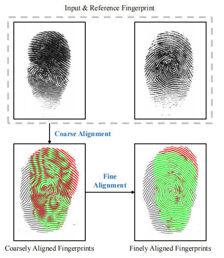
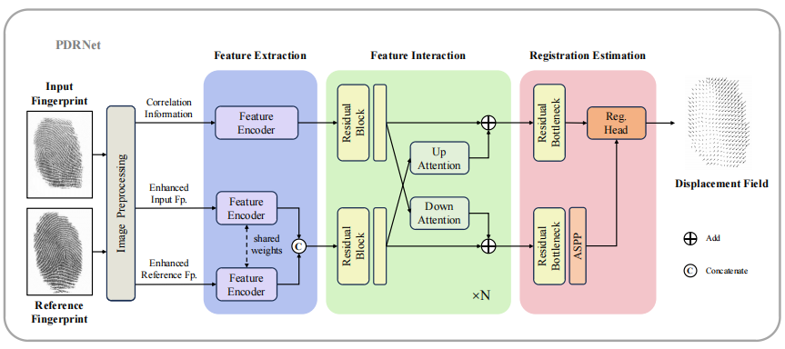

# PDRNet


<a src="https://img.shields.io/badge/cs.CV-2404.17159-b31b1b?logo=arxiv&logoColor=red" href="https://arxiv.org/abs/2404.17159"> 
    
</a> 

### 💬 This repo is the official implementation of:
- ***T-IFS 2024***: [Phase-aggregated Dual-branch Network for Efficient Fingerprint Dense Registration](https://arxiv.org/abs/2404.17159) 

[Xiongjun Guan](https://xiongjunguan.github.io/), Jianjiang Feng, Jie Zhou

<br>

## Introduction
Fingerprint dense registration aims to finely align fingerprint pairs at the pixel level, thereby reducing intra-class differences caused by distortion. Unfortunately, traditional methods exhibited subpar performance when dealing with low-quality fingerprints while suffering from slow inference speed. Although deep learning based approaches shows significant improvement in these aspects, their registration accuracy is still unsatisfactory. In this paper, we propose a Phase-aggregated Dual-branch Registration Network (PDRNet) to aggregate the advantages of both types of methods. A dual-branch structure with multi-stage interactions is introduced between correlation information at high resolution and texture feature at low resolution, to perceive local fine differences while ensuring global stability. Extensive experiments are conducted on more comprehensive databases compared to previous works. Experimental results demonstrate that our method reaches the state-of-the-art registration performance in terms of accuracy and robustness, while maintaining considerable competitiveness in efficiency.

The overall flowchart of our proposed algorithm is shown as follows.
<br>
<p align="center">
     <br />
</p>
<br>

The structure of **PDRNet** (the name `PDR` stands for **P**hase-aggregated **D**ual-branch **R**egistration) is shown as follows.
<br>
<p align="center">
     <br />
</p>
<br>

## Notice :exclamation:
Due to potential business cooperation, public access to this repository is restricted. 

Please email us to request permission if code is needed.

<br>

## News :bell:
- **[Septs. 22 2024]** Public access to this repository is restricted.
- **[May 24 2024]** Code is coming.

<br>
  

## Requirements
```shell
numpy==1.26.4
opencv_python==4.8.1.78
PyYAML==6.0.1
scipy==1.13.1
torch==2.1.2
tqdm==4.66.1
```


## Data preparation

The file structure is as follows:
```shell
root_path/examples/
├── data_img
|   ├── 1a.png
|   ├── 1b.png
|   ├── ......
├── data_bimg
|   ├── 1a.png
|   ├── 1b.png
|   ├── ......
├── data_mask
|   ├── 1a.png
|   ├── 1b.png
|   ├── ......
├── results_img
|   ├── ......
├── results_bimg
|   ├── ......
├── results_mask
|   ├── ......
├── results
|   ├── ......
```

## Run
* **Inference**
    ```shell
    python inference.py
    ```

* **Evaluation**
    ```shell
    python eval.py
    ```


## Citation
If you find this repository useful, please give us stars and use the following BibTeX entry for citation.
```
@article{guan2024phase,
  author={Guan, Xiongjun and Feng, Jianjiang and Zhou, Jie},
  journal={IEEE Transactions on Information Forensics and Security}, 
  title={Phase-Aggregated Dual-Branch Network for Efficient Fingerprint Dense Registration}, 
  year={2024},
  volume={19},
  pages={5712-5724},
```


## License
This project is released under the MIT license. Please see the LICENSE file for more information.

## Contact me
If you have any questions about the code, please contact Xiongjun Guan gxj21@mails.tsinghua.edu.cn
